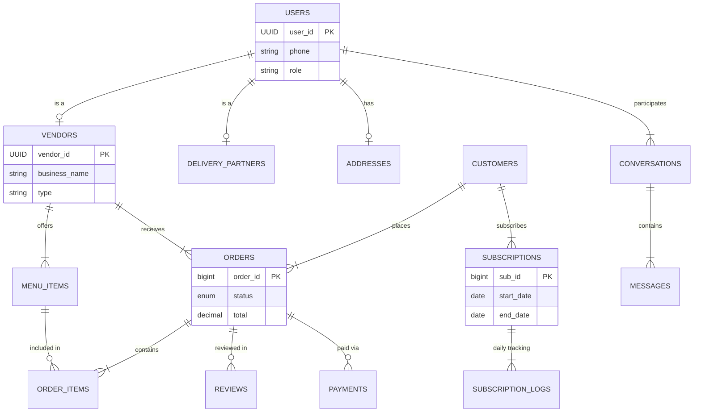

# TiFFLu - Database Design Document

## 1. Requirement Understanding

**Project Scope:**  
TiFFLu is a comprehensive food delivery platform catering to standard Hotels, Mess services (Tiffin plans), Home Food providers, and Delivery partners. The system manages order lifecycles, subscriptions for mess services, live tracking, and real-time communication.

**Major Actors:**
*   **Customer:** Browses menus/mess plans, places orders, buys subscriptions, tracks delivery.
*   **Vendor (Hotel/Mess/Home Cook):** Manages menu/plans, accepts orders, updates status.
*   **Delivery Partner:** Accepts delivery request, updates location/status.
*   **Admin:** System oversight (not fully detailed in frontend but implied for verification).

**Core Entities:**
*   **Users:** Base entity for authentication.
*   **Vendors/Partners:** Specialized profiles linked to users.
*   **Menu/Plans:** Food items and monthly subscriptions.
*   **Orders:** Transactional data for immediate delivery.
*   **Subscriptions:** Long-term commitments for daily meals.
*   **Chat/Reviews:** Social interaction.

---

## 2. Database Design Rules implemented
*   **Normalization:** 3NF applied. Attributes dependent only on the primary key.
*   **Naming:** Snake_case used throughout (`user_id`, `created_at`).
*   **Constraints:** Foreign keys enforced with `ON DELETE CASCADE` where appropriate (e.g., deleting a user deletes their profile).
*   **Data Integrity:** `ENUM`s used for status fields to prevent invalid states.
*   **UUIDs:** used for User IDs to allow scalable, distributed generation without collision.

---

## 3. Relationships & ER Diagram

### Key Relationships
*   **Users table is the parent** of `vendors`, `delivery_partners`, and `customers` (One-to-One logic via Shared PK or FK).
*   **Vendor** `One-to-Many` **Menu Items**.
*   **Customer** `One-to-Many` **Orders**.
*   **Order** `Many-to-Many` **Menu Items** (Resolved via `order_items` junction table).
*   **Customer** `One-to-Many` **Subscriptions**.
*   **Subscription** `One-to-Many` **Subscription Logs** (Daily delivery records).

### ER Diagram (Mermaid)

---

## 4. Documentation & Flow

### Data Flow
1.  **Registration:** A user registers in existing `users` table. If they are a vendor, a record is also created in `vendors`.
2.  **Ordering:** 
    *   Customer creates an `order`.
    *   Items are snapshot into `order_items` (preserving price at that moment).
    *   Payment record created in `payments`.
3.  **Subscription:**
    *   Customer buys "Standard Monthly Tiffin".
    *   Row added to `subscriptions` with start/end dates.
    *   Every day, a cron job (future scope) or trigger checks active subscriptions and generates a `subscription_logs` entry for the day's delivery.
4.  **Delivery:**
    *   `partner_id` in `orders` is initially NULL.
    *   When a driver accepts, `partner_id` is updated.
    *   Status moves: Pending -> Preparing -> Out for Delivery -> Delivered.

### Scalability Suggestions
*   **Partitioning:** `orders` and `messages` tables will grow fast. Partition by date (e.g., monthly) for performance.
*   **Read Replicas:** Separate read/write connections if traffic spikes.
*   **Caching:** Redis should be used for `menu_items` and active `vendors` to reduce DB load.
*   **Archiving:** Move old `subscription_logs` and `orders` to a cold storage archive after 1 year.
