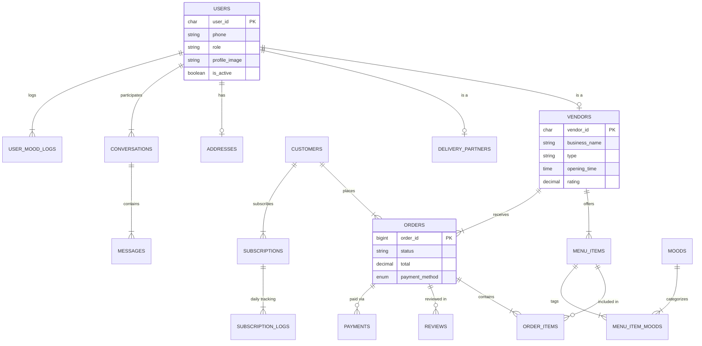

# TiFFLu Project Schema Documentation

Database schema for the TiFFLu food delivery platform. This document reflects the current codebase implementation including the new Mood-Based Food Suggestions module.

Implemented in Code

## Entity Relationship Diagram

## Table Definitions

### 1. Users Core
Manages central identity for Customers, Vendors, Delivery Partners, and Admins.

| Column | Type | Notes |
| :--- | :--- | :--- |
| `user_id` | CHAR(36) | **Primary Key**. UUID format. |
| `phone_number` | VARCHAR(15) | Unique. Indexed for fast login lookup. |
| `email` | VARCHAR(255) | Unique. Optional for some users. |
| `password_hash` | VARCHAR(255) | Stores BCrypt/Argon2 hash. |
| `full_name` | VARCHAR(100) | Display name. |
| `role` | ENUM | 'customer', 'vendor', 'delivery_partner', 'admin'. |
| `profile_image_url` | VARCHAR(500) | URL to profile picture. |
| `is_active` | BOOLEAN | Account active status (default TRUE). |
| `is_verified` | BOOLEAN | KYC or OTP verification status. |
| `created_at` | TIMESTAMP | Account creation time. |
| `updated_at` | TIMESTAMP | Last update time. |

### 2. Vendors Core
Extended profile for Hotels, Messes, and Home Cooks.

| Column | Type | Notes |
| :--- | :--- | :--- |
| `vendor_id` | CHAR(36) | **Primary Key**. FK -> Users. |
| `business_name` | VARCHAR(150) | Name of the restaurant/mess. |
| `business_type` | ENUM | 'hotel', 'mess', 'homemade'. |
| `description` | TEXT | Description of the vendor. |
| `fssai_license` | VARCHAR(50) | Food safety license number (Unique). |
| `opening_time` | TIME | Shop opening time. |
| `closing_time` | TIME | Shop closing time. |
| `is_open` | BOOLEAN | Real-time shop status. |
| `rating` | DECIMAL(3,2) | Cached average rating (e.g., 4.5). |
| `review_count` | INT | Total number of reviews. |
| `min_order_value` | DECIMAL(10,2) | Minimum cart value for delivery. |

### 3. Delivery_Partners Core
Extended profile for delivery drivers.

| Column | Type | Notes |
| :--- | :--- | :--- |
| `partner_id` | CHAR(36) | **Primary Key**. FK -> Users. |
| `vehicle_number` | VARCHAR(20) | Registration number. |
| `vehicle_type` | ENUM | 'bike', 'scooter', 'cycle'. |
| `current_status` | ENUM | 'offline', 'available', 'busy'. |
| `current_latitude` | DECIMAL(10,8) | Live GPS latitude. |
| `current_longitude` | DECIMAL(11,8) | Live GPS longitude. |
| `rating` | DECIMAL(3,2) | Driver rating. |

### 4. Menu_Items Core
Individual food items or subscription plans.

| Column | Type | Notes |
| :--- | :--- | :--- |
| `item_id` | BIGINT | **Primary Key**. Auto-increment. |
| `vendor_id` | CHAR(36) | FK -> Vendors. |
| `category_id` | INT | FK -> Categories. |
| `name` | VARCHAR(150) | Dish name (e.g., "Paneer Butter Masala"). |
| `description` | TEXT | Description of the item. |
| `price` | DECIMAL(10,2) | Base price. |
| `item_type` | ENUM | 'standard' or 'subscription_plan'. |
| `is_veg` | BOOLEAN | Vegetarian flag. |
| `image_url` | VARCHAR(500) | URL to item image. |
| `is_available` | BOOLEAN | In-stock status. |
| `is_chef_special` | BOOLEAN | **New**: Highlights item as Chef's Special. |
| `created_at` | TIMESTAMP | Creation time. |

### 5. Orders Core
Central transaction record.

| Column | Type | Notes |
| :--- | :--- | :--- |
| `order_id` | BIGINT | **Primary Key**. |
| `customer_id` | CHAR(36) | FK -> Users. |
| `vendor_id` | CHAR(36) | FK -> Vendors. |
| `partner_id` | CHAR(36) | FK -> Delivery_Partners (Nullable). |
| `order_status` | ENUM | 'pending', 'accepted', 'preparing', 'ready', 'out_for_delivery', 'delivered', 'cancelled'. |
| `payment_status` | ENUM | 'pending', 'paid', 'failed', 'refunded'. |
| `payment_method` | ENUM | 'cod', 'upi', 'card'. |
| `total_amount` | DECIMAL(10,2) | Final bill amount. |
| `delivery_fee` | DECIMAL(10,2) | Delivery charges. |
| `tax_amount` | DECIMAL(10,2) | Taxes. |
| `special_instructions` | TEXT | User instructions. |
| `placed_at` | TIMESTAMP | Order placement time. |
| `delivered_at` | TIMESTAMP | Delivery completion time. |

### 6. Subscriptions Core
Long-term meal plans (Mess service).

| Column | Type | Notes |
| :--- | :--- | :--- |
| `subscription_id` | BIGINT | **Primary Key**. |
| `customer_id` | CHAR(36) | FK -> Users. |
| `vendor_id` | CHAR(36) | FK -> Vendors. |
| `plan_item_id` | BIGINT | FK -> Menu_Items. |
| `start_date` | DATE | Subscription start date. |
| `end_date` | DATE | Subscription end date. |
| `total_days` | INT | Duration in days. |
| `paid_amount` | DECIMAL(10,2) | Amount paid. |
| `status` | ENUM | 'active', 'expired', 'paused', 'cancelled'. |

### 7. Moods New Feature
Defines emotional states for food recommendations.

| Column | Type | Notes |
| :--- | :--- | :--- |
| `mood_id` | INT | **Primary Key**. |
| `name` | VARCHAR(50) | E.g., 'Happy', 'Sad', 'Bored'. |
| `icon_url` | VARCHAR(500) | UI asset URL. |

### 8. Menu_Item_Moods New Feature
Mapping table linking foods to suitable moods.

| Column | Type | Notes |
| :--- | :--- | :--- |
| `item_id` | BIGINT | FK -> Menu_Items. |
| `mood_id` | INT | FK -> Moods. |

### 9. Reviews Core
User feedback on orders.

| Column | Type | Notes |
| :--- | :--- | :--- |
| `review_id` | BIGINT | **Primary Key**. |
| `order_id` | BIGINT | FK -> Orders. Unique (One review per order). |
| `customer_id` | CHAR(36) | FK -> Users. |
| `vendor_id` | CHAR(36) | FK -> Vendors. |
| `rating` | INT | 1-5 Stars. |
| `comment` | TEXT | User review text. |
| `created_at` | TIMESTAMP | Review timestamp. |

### 10. Conversations Core
Chat threads between users.

| Column | Type | Notes |
| :--- | :--- | :--- |
| `conversation_id` | BIGINT | **Primary Key**. |
| `participant1_id` | CHAR(36) | FK -> Users. |
| `participant2_id` | CHAR(36) | FK -> Users. |
| `started_at` | TIMESTAMP | Conversation start time. |
| `updated_at` | TIMESTAMP | Last message time. |

### 11. Messages Core
Chat messages history.

| Column | Type | Notes |
| :--- | :--- | :--- |
| `message_id` | BIGINT | **Primary Key**. |
| `conversation_id` | BIGINT | FK -> Conversations. |
| `sender_id` | CHAR(36) | FK -> Users. |
| `content` | TEXT | Message text. |
| `is_read` | BOOLEAN | Read status. |
| `sent_at` | TIMESTAMP | Time sent. |

### 12. Payments Core
Payment transactions.

| Column | Type | Notes |
| :--- | :--- | :--- |
| `transaction_id` | VARCHAR(100) | **Primary Key**. Payment Gateway ID. |
| `order_id` | BIGINT | FK -> Orders (Nullable). |
| `subscription_id` | BIGINT | FK -> Subscriptions (Nullable). |
| `amount` | DECIMAL(10,2) | Transaction amount. |
| `method` | ENUM | 'upi', 'card', 'netbanking', 'wallet'. |
| `status` | ENUM | 'success', 'failed', 'pending', 'refunded'. |
| `created_at` | TIMESTAMP | Transaction time. |

### 13. User_Mood_Logs New Feature
History of user reported moods.

| Column | Type | Notes |
| :--- | :--- | :--- |
| `log_id` | BIGINT | **Primary Key**. |
| `user_id` | CHAR(36) | FK -> Users. |
| `mood_id` | INT | FK -> Moods. |
| `logged_at` | TIMESTAMP | Time of log. |
